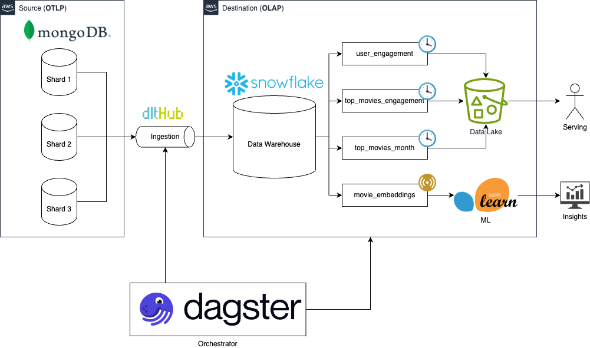
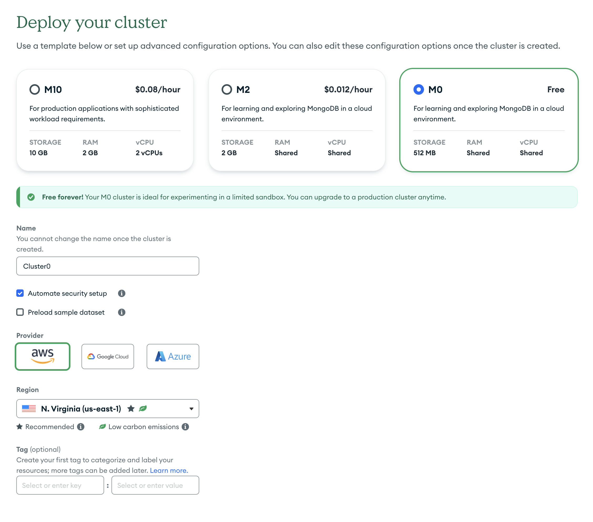
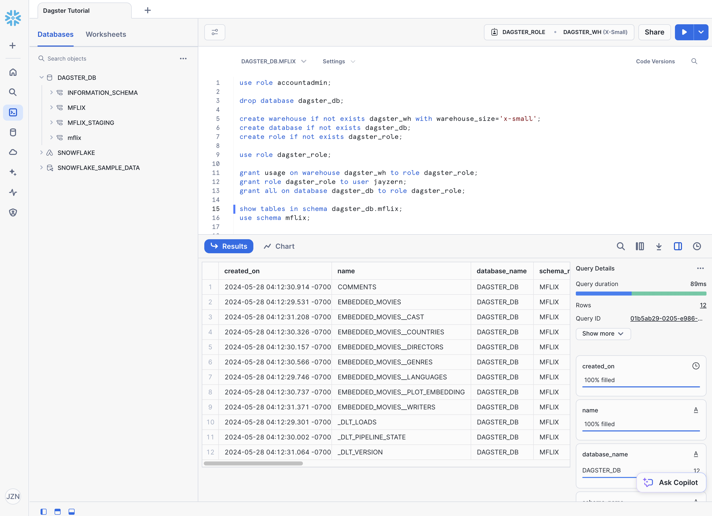

# Dagster Mflix Demo

<div align="center">
  <a target="_blank" style="background:none">
    
  </a>
  <a target="_blank">
    
  </a>
  <a target="_blank">
    
  </a>
  <a target="_blank">
    
  </a>
</div>

This repository contains a demo ELT project created using Dagster and the Mflix dataset, covering features including:

1. Asset based, declarative orchestration
2. Embedded ELT using data load tool
3. How to backfill DAGs using Partitions
4. How to setup Schedules and Jobs
5. Experimental features: Sensors and Auto Materialization policies

## Installation

Create a virtual environment. Install dagster core and dagster embedded ELT.

```bash
conda create -n "dagster-mflix" python=3.11.8
conda activate dagster-mflix
pip install dagster==1.7.7 dagster-embedded-elt==0.23.7
```

Install required dependencies based on `setup.py`. Use `--editable` flag so code changes are reflected, and use `[dev]` target here.
```bash
pip install -e ".[dev]"
```

Then, start the Dagster UI web server:

```bash
dagster dev
```

Open http://localhost:3000 with your browser to see the project.

## System Architecture

At a high level we're building an ELT pipeline that ingests data from a source database (OLTP) to a data warehouse (OLAP).

Dagster is our orchestrator used to generate [Assets](https://docs.dagster.io/concepts/assets/software-defined-assets), which are objects in persistant storage that capture some understanding of this world.

For our dataset, we will be using the [Mflix dataset](https://www.mongodb.com/docs/atlas/sample-data/sample-mflix) provided by MongoDB in order to generate insights about movies and user engagement scores.



## Configure Snowflake and MongoDB

Sign up for MongoDB Atlas and load the sample Mflix dataset: https://www.mongodb.com/docs/atlas/sample-data/#std-label-load-sample-data



Sign up for Snowflake. Create relevant warehouse, database and role in the Snowflake UI.
```sql
use role accountadmin;

create warehouse if not exists dagster_wh with warehouse_size='x-small';
create database if not exists dagster_db;
create role if not exists dagster_role;

grant usage on warehouse dagster_wh to role dagster_role;
grant role dagster_role to user jayzern;
grant all on database dagster_db to role dagster_role;
```



Finally, copy paste the contents of `template.env` into `.env` and replace the credentials with your own. Export your snowflake auth details using environment variables, i.e. `export snowflake_user=myuser`

```
SOURCES__MONGODB__MONGODB__CONNECTION_URL="mongodb+srv://<user>:<password>@cluster0"
DESTINATION__SNOWFLAKE__CREDENTIALS__DATABASE="dagster_db"
DESTINATION__SNOWFLAKE__CREDENTIALS__PASSWORD=${snowflake_password}
DESTINATION__SNOWFLAKE__CREDENTIALS__USERNAME=${snowflake_user}
DESTINATION__SNOWFLAKE__CREDENTIALS__HOST=${snowflake_account}
DESTINATION__SNOWFLAKE__CREDENTIALS__WAREHOUSE="dagster_wh"
DESTINATION__SNOWFLAKE__CREDENTIALS__ROLE="dagster_role"

SNOWFLAKE_ACCOUNT=${snowflake_account}
SNOWFLAKE_USER=${snowflake_user}
SNOWFLAKE_PASSWORD=${snowflake_password}
```
